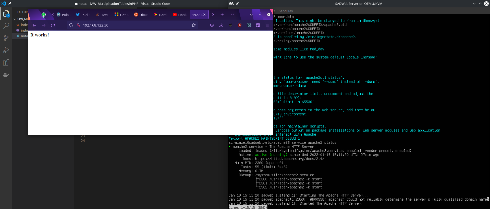
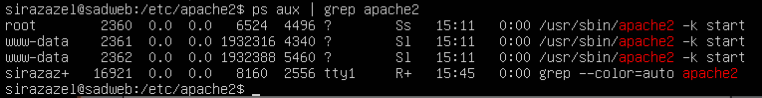

# Hárdening de un servidor Apache
## Configuración básica
Para empezar con la instalación y configuración de un servidor Apache, primero aseguraremos que el gestor de paquetes actualice los repositorios de paquetes.

Después instalaremos los paquetes de Apache.
```bash
# apt update
# apt install apache2
```
Podemos ver si el servicio está funcionando correctamente después de instalarlo ejecutando
```bash
# service apache2 status
```
El output debería ser similar a este:


Como se puede ver, es conveniente quitar el index.html original y modificarlo con un documento de prueba. El index.html por defecto, tanto de PHP como de Apache, conllevan información sensible que no puede ser vista por el público.

Todos estos documentos por defecto se encuentran en 
```\var\www\html ```, así que podemos sustituir su contenido con

```bash
# echo "Hello World!" > /var/www/html/index.html
```
## Usuarios y grupos

Apache por defecto utiliza el usuario y grupo www-data, pero no está de más comprobarlo para asegurarnos de que en caso de ataque fructífero, el atacante no posea permisos de administrador directamente.

Basta verificar en el fichero ``` apache2.conf ``` y en el fichero ```envvars``` que las líneas siguientes apuntan al usuario y grupo correcto.

Buscamos estas líneas en envvars:
```bash
export APACHE_RUN_USER=www-data
export APACHE_RUN_GROUP=www-data
```

Verificamos el usuario propietario de los procesos con ``` ps aux | grep apache2```



## Ocultación de versiones

Recomendamos encarecidamente ocultar la versión de Apache a los navegadores, ya que es una política sencilla de aplicar y dificulta el reconocimiento de un posible atacante menos experimentado. Conociendo la versión exacta es más facil de averiguar vulnerabilidades en el servidor.

Basta con modificar estas dos líneas en ```apache2.conf```

```bash
ServerTokens Prod
ServerSignature Off
```

## Gestión de módulosrx

Apache permite instalar diferentes módulos para añadir funcionalidades a un site. Para la gestión de los mismos, tenemos tres comandos esenciales:

```bash
$ apache2ctl -M

$ a2enmod nombre

$ a2dismod nombre
```
El primero, nos muestra los modulos instalados y disponibles de nuestra implementación de apache. Con a2enmod y a2dismod podemos activar y desactivar los módulos a medida que los necesitemos. Recomendamos encarecidamente desactivar todos los modulos no usados, ya que pueden tener agujeros de seguridad innecesarios.

## Creación del Virtual Host

## Directivas Options