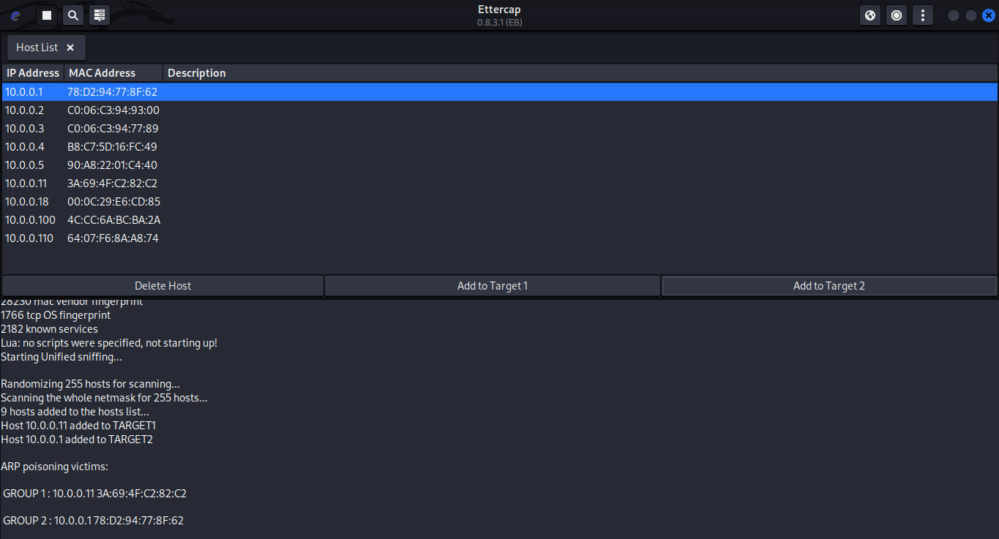
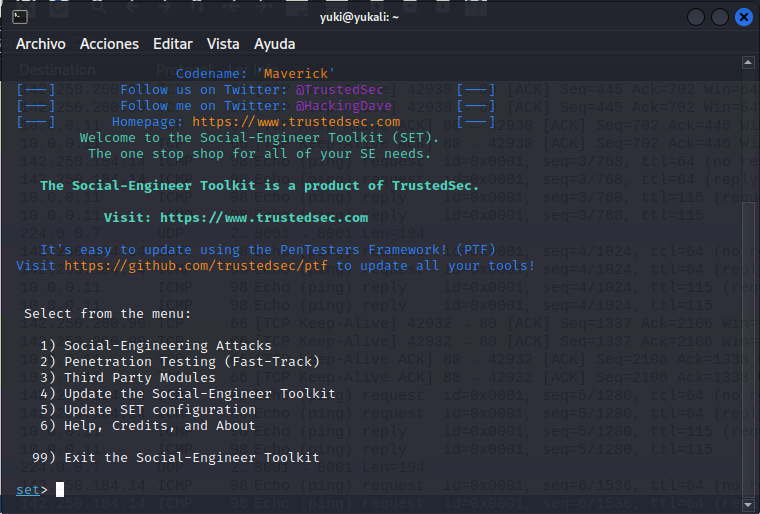
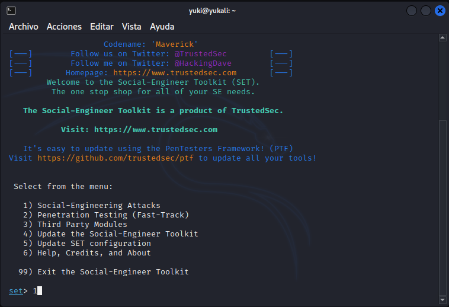
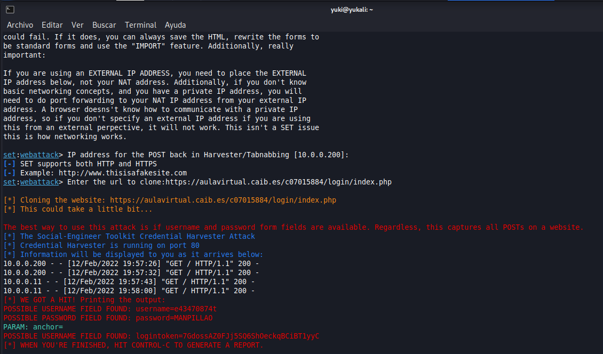

# Concienciación

## MITM

Hoy en día una de las tecnologías más utilizadas a la hora de realizar conexiones inalámbricas es el Wifi, y que problema tiene? Pues que el medio de comunicación es compartido, no es como un cable el cual pertenece al emisor y al receptor, uno en cada extremo. Sino que cualquier dispositivo con una antena Wifi es capaz de "ver" la comunicación de los dispositivos conectados al mismo punto de acceso en el que se encuentra. Y esto como se hace?

Existe una técnica de hacking conocida como "man in the middle" la cual consiste en conseguir establecerse como un punto intermedio en las comunincaciones de las victimas. En entornos Wifi se utiliza una táctica conocida como ARP poisoning, y consiste literalmente en envenenar las tablas ARP de las víctimas con tal de que te tengan a tí, el atacante, como punto de acceso. A continución un ejemplo ilustrado de los pasos a seguir y la comprobación del exito del proceso captando un ping a google.com:

## Pharming

Suponiendo que una vez realizado el MITM somos capaces de interceptar y modificar peticiones, o en su defecto alterar el servidor DNS primmario de la víctima. Podemos realizar un ataque conocido como phishing, para ello usaremos `setoolkit` y clonaremos la pagina de login del Moodle del instituto. Y finalmente obtendremos credenciales válidas de inicio de sesión de algún navegante Wifi incauto.

