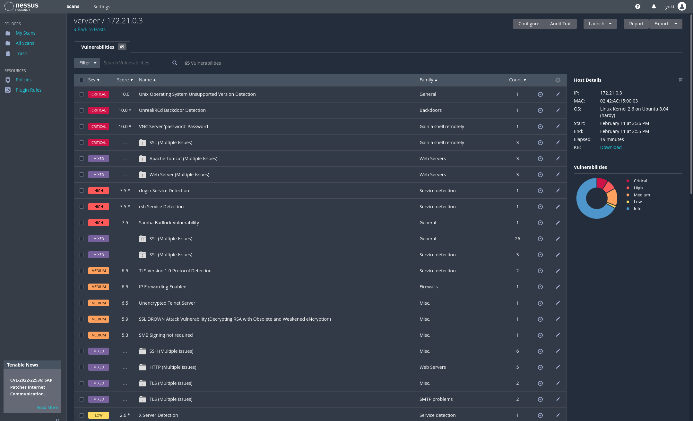
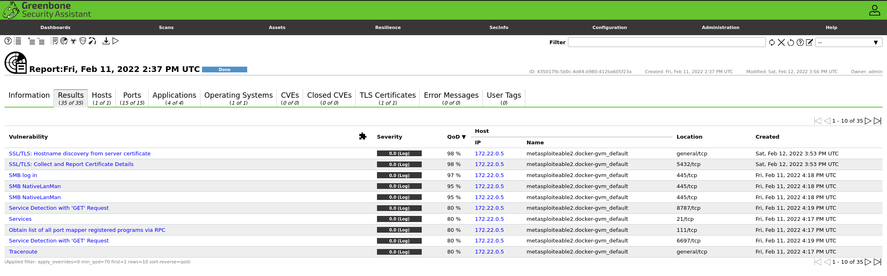
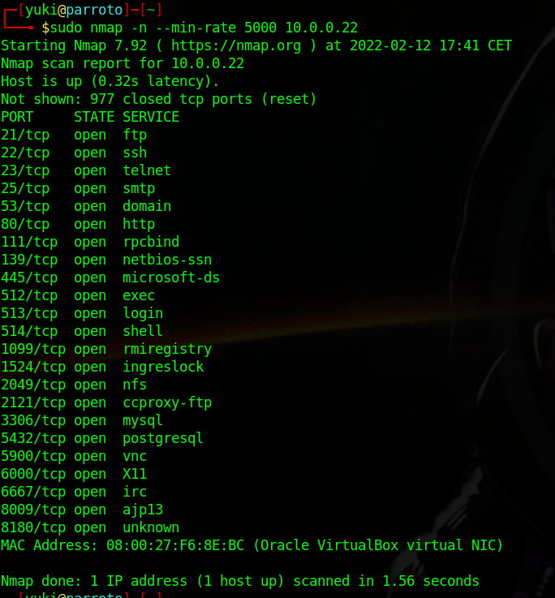
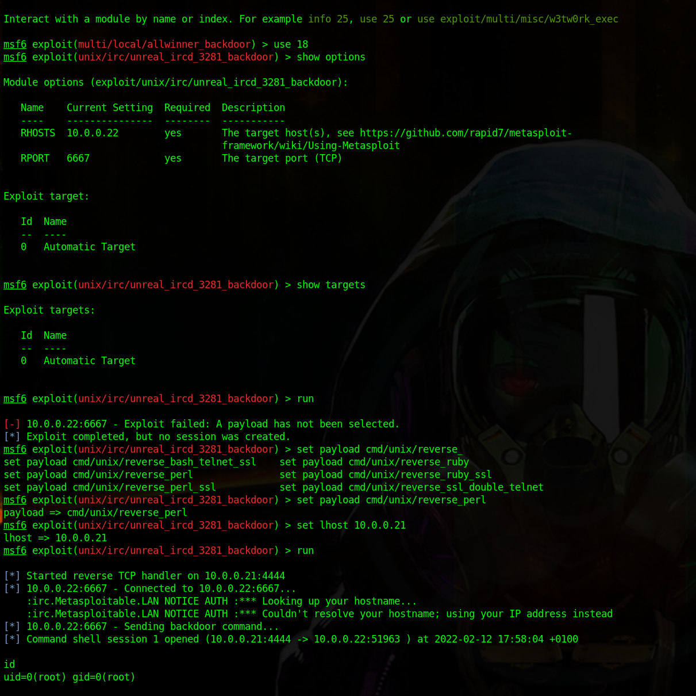

# Escaneo de vulnerabilidades

Como ya aseguramos nuestro servidor en las anteriores actividades de este proyecto ni nessus ni openVas detectan vulnerabilidades, simplemente nos informan de que nos certificados utilzados en nuestro servicio web son autofirmados. Así que procederemos a la deteccción y explotación de vulnerabilidades directamente en Metasploitable2. A continuación imágenes del escaneo a este contenedor, para ello simplemente hicimos un `docker run` definiendo la red de docker en la que queriamos que se crease con un `--network`.

Los resultados son catastróficos como era de esperar, se detectan con nessus unn total de 65 vulnerabilidades. Uno de ellos es el password de VNC, "password", es decir demasiado fácil. Sin embargo explotarlos a través de docker puede ser un poco complicado, lo suyo sería tener la máquina virtual a la que hace referencia esta [guía de explotación](https://docs.rapid7.com/metasploit/metasploitable-2-exploitability-guide/), [enlace a la MV](https://sourceforge.net/projects/metasploitable/).

Podemos adueñarnos del sistema de practicamente cualquier forma, desde usuarios privilegiados de las bases de datos hasta con formularios web php.
A continuación realizaremos una pequeña demostración.

## Reconocimiento

## Explotación de la vulnerabilidad

