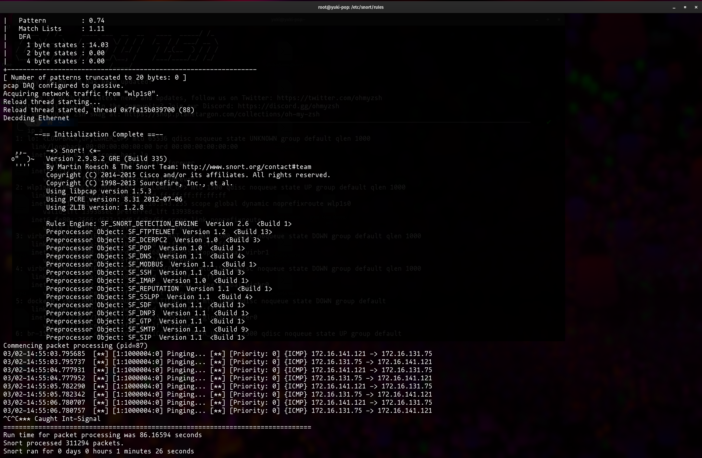
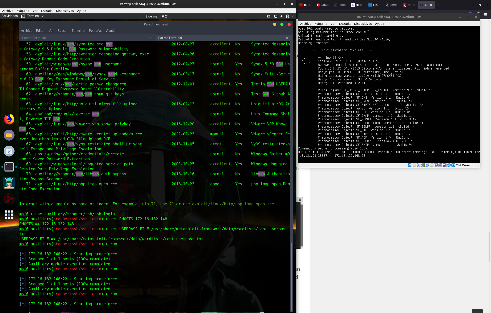

# Snort

Esta herramienta nos ayudará a detectar tráfico sospechoso en nuestra red si lo configuramos como NIDS o solo de nuestra máquina si lo configuramos como HIDS.

## Instalación

El primer paso es la innstalación, es muy recomendable instalar este tipo de servicios directamente en el host ya que docker aplica un overhead a los paquetes que acabará recibiendo nuestro IDS y no nos interesa, ya que implicará menos eficiencia y más falsos positivos muy posiblemente. Además la guía del Incibe utiliza este método.

*Se llegó a esta conclusión tras varios intentos de configuración con un software similar llamado "Suricata" y con el firewall "Pfsense" en el pasado*

```bash
$sudo apt install snort
```

[Tutorial Snort3](https://linoxide.com/install-snort-on-ubuntu/)

## Configuración

La mayoría de configuración esta definida en `/etc/snort/snort.con` mientras que las reglas se encuentran en el directorio `/etc/snort/rules`.

**Directivas**

|Directiva|Valor|Descripción|
|---------|-----|-----------|
|HOME_NET |any  |Detectar ataques de la red interna del server|
|EXTERNAL_NET|any|Detectar ataques de cualquier red que no sea la interna|
|SERVERS|$HOME_NET|Definimos la red en la que se encuentran los servidores|
|PORTS|n_puerto|Definimos los puertos utilizados por los servicios|
|WHITE_LIST_PAT|/etc/snort/rules|Ubicación de las reglas|
|BLACK_LIST_PATH|/etc/snort/rules|Ubicación de las reglas|

**Reglas**

A la hora de definir reglas debemos entender como funciona su sintaxis, lo primero que debemos saber este estas contienen un identificador de regla, comenzando en el numero "1000000". Y estas siguen la estructura de: Acción | Protocolo | IP Origen | Puerto Origen |Dirección | IP Destino | Puerto Destino + Regla opcional + Parámetros de regla opcional.

+ Acción:
    + alert
    + log
    + pass
    + drop
    + reject
    + sdrop

+ Origen/Destino:
    + IP/RED
    + any

+ Puertos:
    + N
    + any

+ Dirección:
    + -> 
    + <>

Ejemplo:

```bash
alert tcp 10.0.0.0/24 any -> any any (msg: "Algo ha hecho saltar alerta"; content: "Petó algo"; sid:1000001; rev:1;)
```

## Demostración



Anteriormente demostramos que era posible el ataque por fuerza bruta a SSH, así que vamos a desactivar el fail2ban y vamos a realizar el ejercicio de forma que será snort quien registre y deniegue los paquetes.

Hemos creado un archivo llamado `ssh-custom.rules` en la ruta `/etc/snort/rules` y agregado este archivo a la configruación de snort mediante un `Include $RULE_PATH/ssh-custom.rules`. Con la siguiente cadena en su interior: 

```
alert tcp any any -> any 22 (msg:"Possible SSH brute forcing!"; flags:S+; treshold: type both, track by_src, count 2, seconds 30; sid: 100000040; rev:1;)
``

Esta cadena lo que hace es que al detectar 2 intentos de inicio de sesión fallidos en un servicio SSH en menos de 30 segundos provinientes desde el mismo origen da una alerta por pantalla.



En caso de querer que rechace los paquetes provenientes del origen atacante reemplazamos el "alert" por un "reject" y se apreciará lo siguiente, que solo aparece una única alerta porque el resto de paquetes están siendo rechazados:


