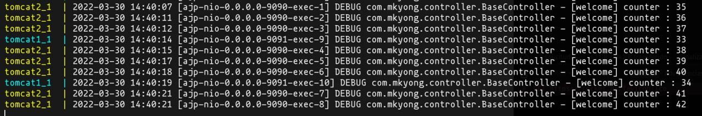
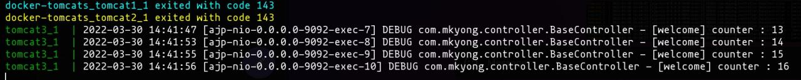
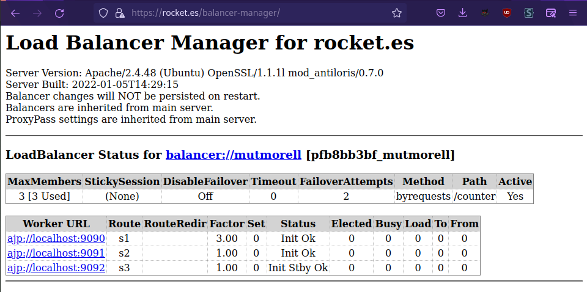

# Configuración de un balanceador de carga para nuestro servicio web.

Ahora que tenemos nuestras aplicaciones .war desplegadas en nuestro servidor, vamos a hacer un balanceador de carga para que no todas las aplicaciones vayan al mismo cluster, y así no saturar al servidor.

Antes que nada, necesitaremos activar unos cuantos mods para Apache2:

```bash
$ sudo a2enmod proxy_balancer
$ sudo a2enmod lbmethod_byrequests
```

El balanceador de carga funcionará de la siguiente manera. El servidor, por defecto usará dos de los tres miembros, y en caso de que ninguno de ellos esté disponible tendremos uno de reserva preparado para nunca dejar sin servicio la página.

El miembro principal del grupo tendrá tres veces más carga que los demás.

Hemos modificado nuestro archivo de configuración del site con las siguientes directivas:

```bash
		<Proxy "balancer://mutmorell">
			BalancerMember "ajp://localhost:9090" loadfactor=3 route=s1
			BalancerMember "ajp://localhost:9091" route=s2
			BalancerMember "ajp://localhost:9092" status=+H route=s3
			ProxySet lbmethod=byrequests
		</Proxy>
		ProxyPass "/counter" "balancer://mutmorell/counter"
```

Entrando en la página rocket.es/counter, accederemos a nuestro servicio en uno de los miembros del clúster


Podemos ver dónde nos ha ido esta peticion utilizando los logs de docker-compose, con el comando ```docker-compose logs -f```



Estas peticiones han ido a los servicios Tomcat 1 y 2.

Si tumbamos los servicios tomcat 1 y 2 podremos ver como se activa el servicio que estaba en modo Hot-Standby.

```bash
    $ docker stop tomcat1
    $ docker stop tomcat2
```



# Balancer-Manager

Para activar el gestor de balanceador propio de Apache, tendremos que asegurarnos de que mod_status de Apache esté activo.

```bash
    $ sudo a2enmod mod_status
```

Bastará con crear una nueva Location en nuestro site y aplicarle las directivas del gestor de balanceador

```bash
<Location "/balancer-manager">
    SetHandler balancer-manager
    # Require host localhost
</Location>
```

En nuestro caso, hemos comentado el Require host localhost ya que para probar si funcionaba el balanceador queríamos entrar desde nuestros dispositivos.

Se recomienda restringir el acceso a este servicio por motivos de seguridad.




En la última foto se puede ver cómo se ha ido repartiendo la carga a medida que hacíamos la practica.


### Referencias

[Apache Load Balancer Configuration](https://ubiq.co/tech-blog/apache-load-balancer-configuration)

[Documentación oficial de Apache](https://httpd.apache.org/docs/trunk/es/howto/reverse_proxy.html)
