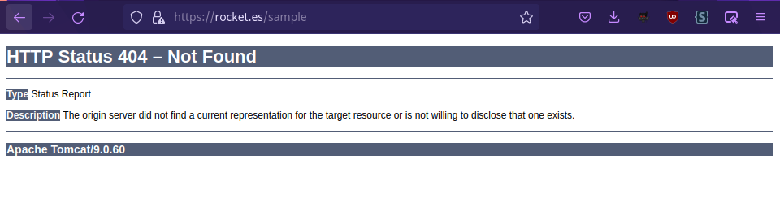
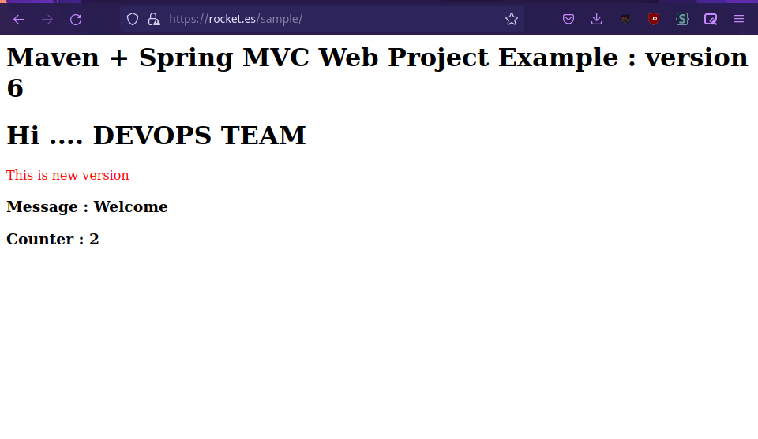
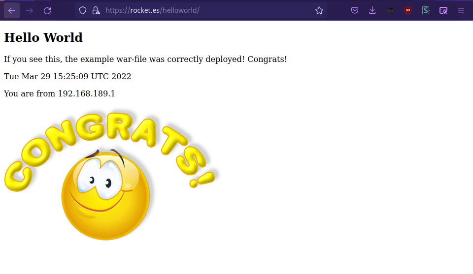

# Configuración de un Reverse Proxy con Apache2

Para poder dar servicio a la página que sirve Tomcat, tendremos que configurar un reverse proxy que detecte todas las peticiones que irán a la ruta [rocket.es/sample](https://rocket.es/sample) para mandarlas a nuestro servidor Tomcat que esté sirviendo nuestros jsp.

```bash
<Location /sample >
    ProxyPass ajp://localhost:9090
</Location>
```

Esta directiva ```location``` en el archivo de configuración del site, indica a Apache que redireccione todo el tráfico que le llegue a /sample hacia el servidor Tomcat en el puerto 9090.

Podemos comprobar que el proxypass funciona accediendo a la web.



El reverse proxy que nos permite ir a ambas aplicaciones quedaría así:

```bash
<Location /counter >
    ProxyPass ajp://localhost:9091/counter
</Location>

<Location /helloworld>
    ProxyPass ajp://localhost:9090/helloworld
</Location>	
```	



